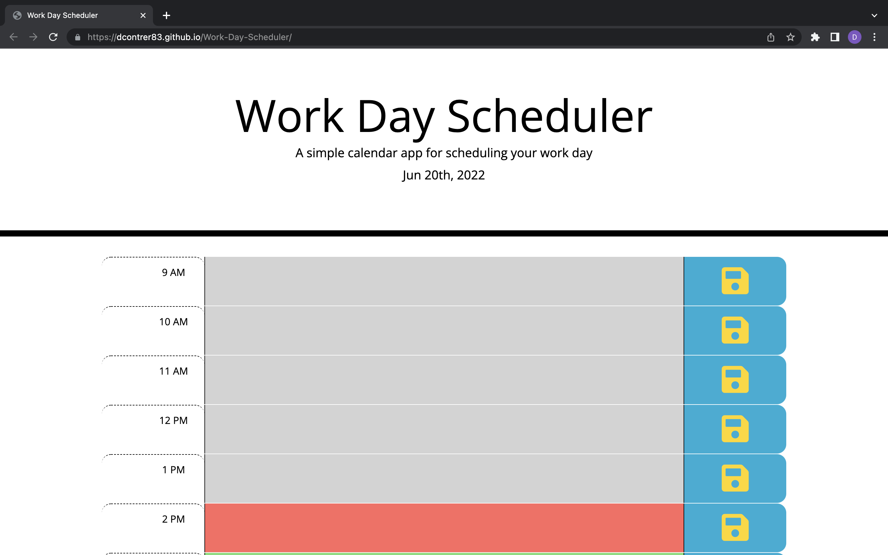
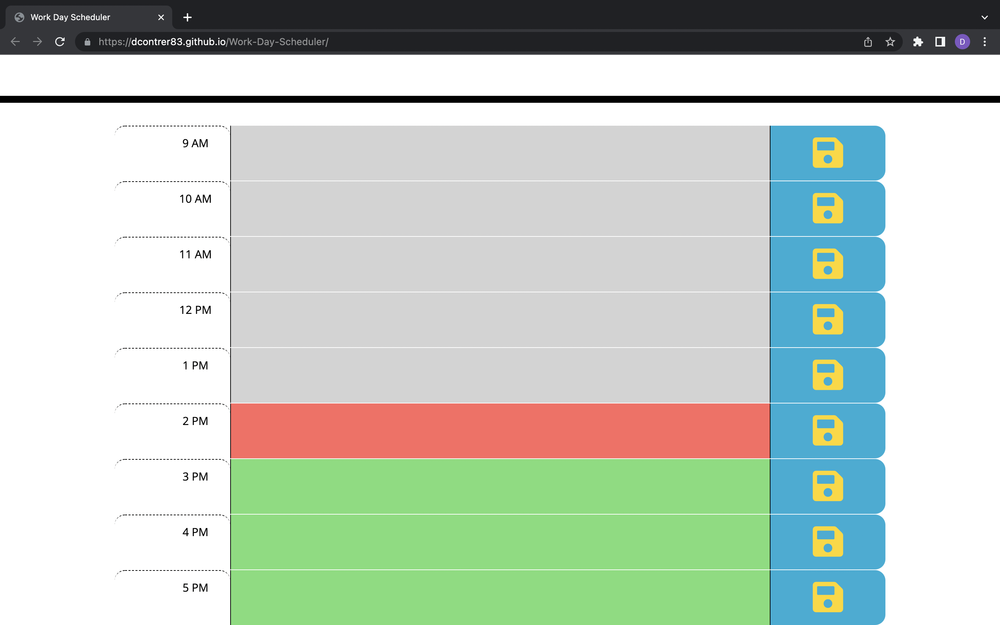
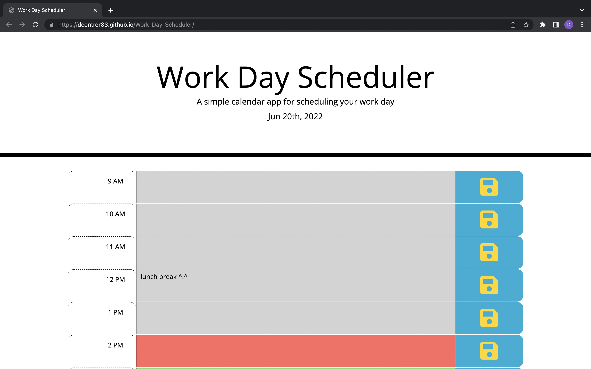

# Work-Day-Scheduler

<h2>Description</h2>
  

This webpage is a work day scheduler that include hours 9 to 5. It includes the current day at the top of the webpage and depending on what hour it is the time blocks will change colors. The colors are grey meaning past hours, red means current hour, and green means future hours. You can change the text in the time block to make your schedule and then local storage save them by pressing the blue button next to that time block.

  
<h2>Screenshots<h2>

<h2>Link</h2>

<a href="https://dcontrer83.github.io/Work-Day-Scheduler/">Work-Day-Scheduler</a>